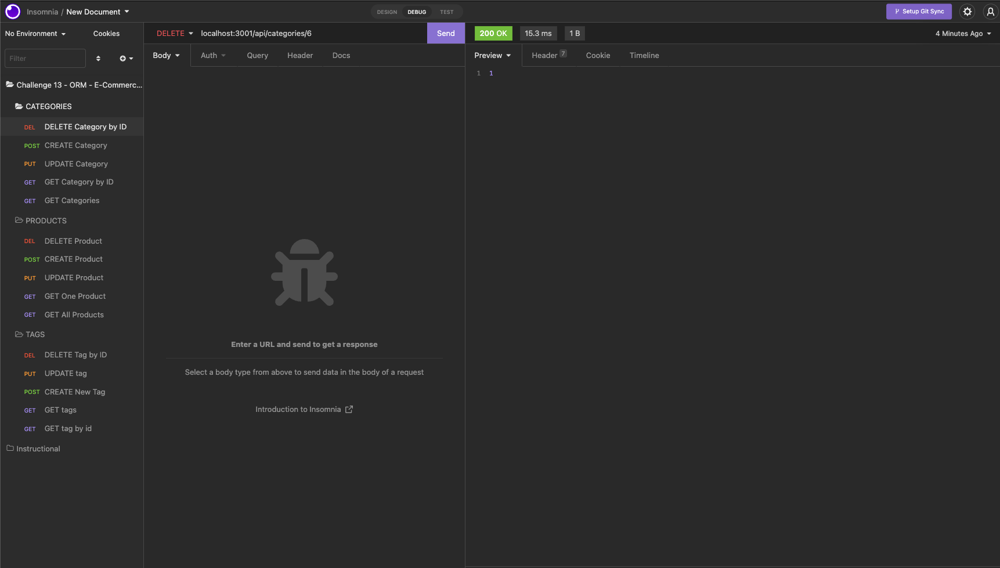

# E-Commerce-Back-End

## Description

This application is an exercise in Object-Relational Mapping (ORM) by implementing api routes for an E-Commerce backend. 
Utilization of Express in combination with Node.js and MySQL allows for a user/retail owner to request and receive database information.

## Criteria and Technologies Used
- Packages include Express.js, Sequelize (query methods), Node.js
- MySQL Database use
- Used Insomnia to test api environments 

## Video Walkthrough 
[Video Walkthrough](https://drive.google.com/file/d/1E0khznFpmBdqKNtjtfRf23TA8atPcI7V/view)

## Screenshots 

## Contact and Contributions 
[GitHub Profile](https://github.com/BrandtDavidson)

Instructional/Starter assets and materials provided by Trilogy Education Services, 2U and University of Arizona.